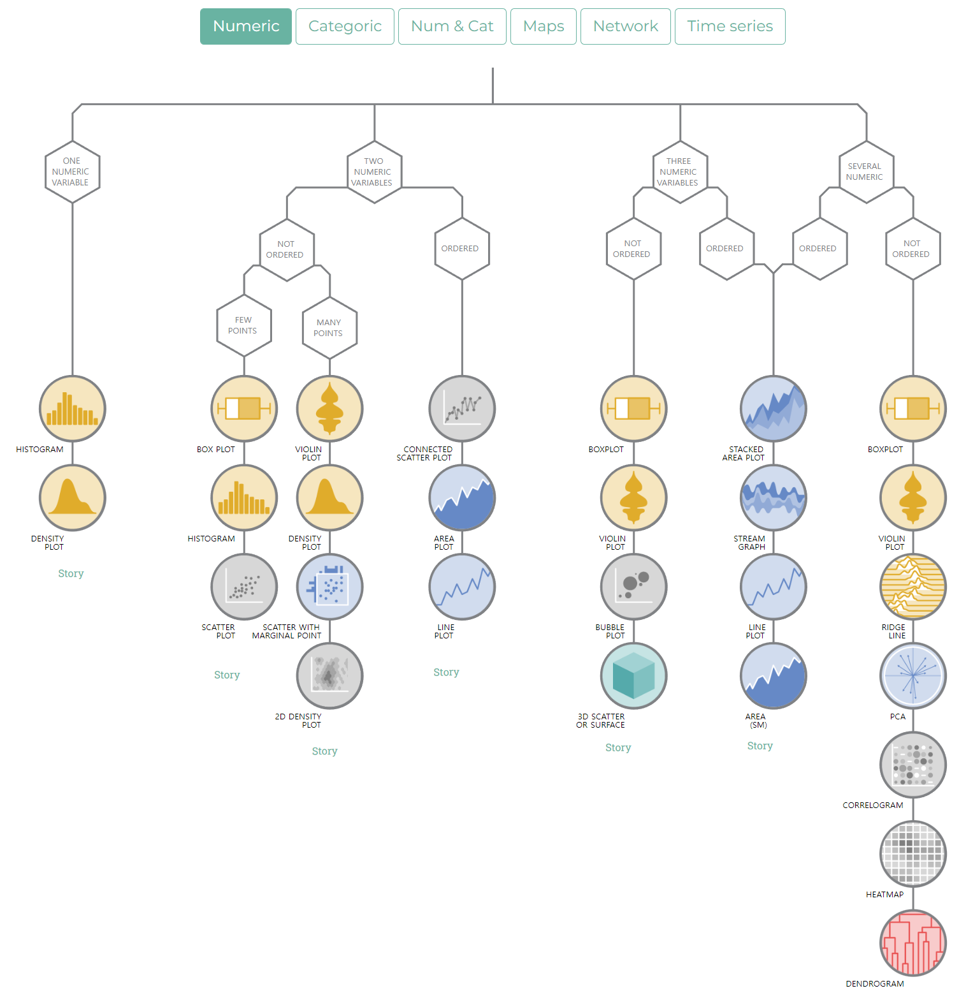

## UPGRADE

### 관련 강의 사이트

### 공통
  * 네이버 부스트코드(https://www.boostcourse.org/) ****(좋음)
  * Coursera(https://www.coursera.org/) ****(좋음)
  * Udacity Courses(https://www.udacity.com/courses/all) ****(좋음)
  * Udemy(https://www.udemy.com/) ***(무료/유료 강좌 사이트)
  * 구름EDU(https://edu.goorm.io/)
  * 이노베이션스퀘어 [Link](http://ictinnovation.kr/)

### 관련 TOOL
### 분석 도구 및 유용한 도구 
| 구분 | 이름 | 특징 | 링크 | 비고 | 
| --- | --- | --- | --- | --- |
| 유튜브 인기순위 | Playboard  | --- | https://playboard.co/ |--- |
| 유튜브 인기순위 | 녹스인플로언스 | --- | https://kr.noxinfluencer.com/ |  |
| 수익확인 | YTLarge | --- | https://ytlarge.com/ |  |
| 이미지변경 | cloudconvert | --- | https://cloudconvert.com/ |  |
| Tiktok 무료 다운로드 |  | SnapTik | https://snaptik.kim/ | TipTok 사이트 URL로 영상다운로드  |

### TTS
| 구분 | 이름 | 특징 | 링크 | 비고 | 
| --- | --- | --- | --- | --- |
| TTS | VOICEVOX  | 무료, 일본어 | https://voicevox.hiroshiba.jp/ |--- |

### 이미지/비디오 생성 AI 사이트
| 구분 | 이름 | 특징 | 링크 | 비고 | 
| --- | --- | --- | --- | --- |
| 비디오 생성 AI  | ImageFX | 비디오 생성 | https://labs.google/fx/tools/image-fx | 영상 제작   |
| 비디오 생성 AI  | hailuoai | 비디오 생성 | https://hailuoai.video/ | 영상 제작   |
| 비디오 생성 AI  | Genspark | 비디오, 이미지 생성 | https://www.genspark.ai/  | 무료로 많은 기능 제공, 마인트맵  |
| 비디오 생성 AI  | Google AI Studio | 이미지 생성 | https://aistudio.google.com/  | 영상 제작   |
| 이미지 생성 AI  | Whisk(Google) | 비디오 생성(추후 일반인 공개 예정) | https://labs.google/fx/tools/whisk | 이미지 생성   |
| 이미지 생성 AI  | 미드저니(Midjourney) | 이미지 생성 AI | https://www.midjourney.com/explore | 이미지 생성 - 실제로 많이 사용되는 TOOL. 유료 가능(최소 $10)   |
| 이미지 생성 AI   | lumaphoton | 이미지 생성 | https://lumaphoton.com/ | 이미지 제작   |
| 이미지 생성 AI  | Adobe Firefly  | -- | https://firefly.adobe.com/   |Adobe사에서 만든 AI |
| 이미지 생성 AI | Stable Diffusion Online | --- | https://stablediffusionweb.com/ko |--- |
| 이미지 생성 AI  | MS IMAGE CREATOR | 다목적 AI 비서 | https://www.bing.com/images/create | MS 사전 가입 및 로그인 필요 |
| 이미지 생성 AI  | Dreamina | AI 이미지 생성 | https://dreamina.capcut.com/ | 이미지 생성 |
| 이미지/비디오 생성 AI   | klingai | 이미지/비디오 생성 | https://app.klingai.com/global/ | 이미지, 비디오 제작   |
| 이미지 생성 AI  | Stable Diffusion 2.1 Demo | 검색 기능 최적화(출처,  | https://huggingface.co/spaces/stabilityai/stable-diffusion | 무료, 품질이 상대적으로 낮음. 스테이블 디퓨전 2.1 |
| 이미지 생성 AI  | Leonardo.AI  | -- | https://leonardo.ai/   | -- |
| AI 아바타 생성 AI  | Synthesia  | AI 아바타를 활용한 스튜디오급 품질의 비디오 제작 | https://www.synthesia.io/   | -- |
| 비디오 생성 AI  | runway  | 애니메이션이 포함된 비디오 제작에 적합 | https://runwayml.com/  | free Forever |
| 비디오 생성 AI  | sora| OpenAI 에서 만든 Gen AI | https://openai.com/sora/  | -- |
| 비디오 생성 AI  | InVideo AI | 매력적인 마케팅 비디오 제작에 적합 | https://www.genspark.ai/  | free Forever, 플러스: 월 $20, 최대: 48/월 |
| 비디오 생성 AI  | Kaiber AI | 비디오 제작 | https://www.kaiber.ai/superstudio/  | 무료 버전으로 괜찮음. |
| 비디오 생성 AI  | AI Studios by Deepbrain AI  | 사람처럼 보이고 행동하는 AI 아바타 만들기, AI 휴먼과 원활하고 매력적인 대화 가능, 뉴스 등 | https://www.aistudios.com/ko | -- |
| 비디오 생성 AI  | Colossyan   | 기업 교육용 비디오 제작에 특화. AI 아바타로 교육 콘텐츠, 프레젠테이션 비디오 제작. | https://www.colossyan.com/ | 음성을 녹음 후, 이에 대한 영상 생성 |
| 비디오 생성 AI  | wan.video | 비디오 생성 | https://wan.video/  | 영상 제작   |
| 비디오 생성 AI  | Focal | 비디오 생성 | https://focalml.com/  | 영상 제작   |
| 비디오 생성 AI  | Veo2 | 비디오 생성(추후 일반인 공개 예정) | https://veo2ai.com/ | 영상 제작   |

* 기타 참고 : https://www.youtube.com/watch?v=Eyj-i0euL9M

### ChatGPT 관련, OpenAI 관련
  * Prompt Engineering - DeepLearning.AI & OpenAI [Link](https://www.deeplearning.ai/short-courses/chatgpt-prompt-engineering-for-developers/)
  * Reasoning Models 빠른 시작 o1-preview, o1-mini [Link](https://platform.openai.com/docs/guides/reasoning)
  * OpenAI models [Link](https://platform.openai.com/docs/models)
  * API Sample [Link](https://platform.openai.com/docs/quickstart)
     * Chat Completiions, Image Generation, Embeddings, Text-to-speech, Speech-to-text, Moderation, Fine-tuning, Batch, Full API Reference
  * API Pricing [Link](https://openai.com/api/pricing/)

### GEN AI 관련 사이트
| 구분 | 이름 | 특징 | 링크 | 비고 |
| --- | --- | --- | --- |--- |
| 생성 AI 챗봇  | ChatGPT | OpenAI | https://chat.openai.com/ | 무료, $20/월, Pro $200/월 |
| 생성 AI 챗봇  | Claude | Anthropic  | https://claude.ai/ | 무료, $20/월 |
| 생성 AI 챗봇  | Grok | X  | https://grok.com/ | X를 이용하여 가입 무료, $30/월, Pro  $300/월 |
| 생성 AI 챗봇  | Gemini | 글쓰기, 출처 | https://gemini.google.com/ | 무료 및 Pro 월 2만9천원(Veo2,Whisk한도증가) |
| 검색,채팅,이미지생성  | Genspark | 다목적 AI 비서 | https://www.genspark.ai/ | 무료, $19.99/월 |
| 챗봇 생성 AI  | perplexity | 검색 기능 최적화(출처,  | https://www.perplexity.ai/ | 무료, $19.99/월 |
| 챗봇 생성 AI  | wrtn | 글쓰기, 출처 | https://wrtn.ai/ | 무료 및 기타 |
| 챗봇 생성 AI  | 윅스AI | 한국형 업무 AI | https://wrks.ai/ko/chat | 무료, Basic(24,900), AGI(월 99,900) |
| 챗봇 생성 AI  | Felo | 파일분석, PPT생성, 주제당50개 파일 업로드 | https://felo.ai/ | 무료 및 월$14.99 |
| 챗봇 생성 AI  | Alan | 출처, 유튜브 요약 우수 | https://wrtn.ai/ | 무료 및 기타 |
| 영상요약 AI  | Lilys AI | 영상, 음성, PDF, 웹사이트 요약 | https://lilys.ai/ | 무료 및 기타 |
| 회의록 작성, 보고서 시각화  | Napkin AI | 회의록 작성, 보고서 시각화, 도식화 자동 생성 | https://www.napkin.ai/ | -- |
| 강의 자료 분석  | Notebook LM | 문서 기반 데이터 분석 및 정보 추출. | https://www.napkin.ai/ | -- |

### 음악 생성 AI
| 구분 | 이름 | 특징 | 링크 | 비고 | 
| --- | --- | --- | --- | --- |
| 음악 생성 AI | UDIO | https://www.udio.com/ |  |--- |
| 음악 생성 AI | suno | https://suno.com/home |  |--- |
| 음악 생성 AI | 일레븐랩스 | https://elevenlabs.io/ |  | --- |

 * 템프 메일: https://temp-mail.org/en/
 * Craiyon(DALL-E mini) [이동하기](https://www.craiyon.com/)
 * 무료 ppt 생성 - Gamma [Link](https://gamma.app/)
 * Playground AI - 게임 에셋 제작 [Link](https://playgroundai.com/)
 * 클로바 더빙 [Link](https://clovadubbing.naver.com/)
 * Viodio     [Link](https://www.viodio.io/main)
 * NovelAI  [Link](https://novelai.net/) : 소설 작성 AI

### 인공지능 강의
  * Andrej Karpathy 님의 1시간짜리 인공지능 강의 (번역) [Link](https://www.youtube.com/watch?v=rRpZEGCpNbE)
  * DeepLearning AI [Link](https://www.deeplearning.ai/courses/)

### 공모전
* Thinkgood - https://www.thinkcontest.com/thinkgood/index.do
* Contest Korea - https://www.contestkorea.com/?int_gbn=1
* Event-us - https://event-us.kr/

| 구분 | 기간 | 특징 | 링크 |
| --- | --- | --- | --- |
| 😄 2024 디지털유산페스타 'AI 헤리티지 공모전  | 4월 1일 ~ 5월 3일 | AI를 활용한 이미지 생성 부문이 있어, Stable Diffusion, DALL-E 등 이미지 생성 모델 학습 내용을 활용할 수 있습니다.   학습한 Prompt Engineering 지식을 직접 활용할 좋은 기회입니다.| [Link](https://www.contestkorea.com/sub/view.php?Txt_gbn=1&Txt_bcode=030710001&str_no=202404130008) |
| 🔍 제주 글로벌 AI 필름 공모전 | 25/1/10 ~ 25/3/31 | AI 기술을 활용하여 영상을 만들 수 있는 누구나 | [Link](https://www.wevity.com/index_university.php?c=find&s=_university&gub=1&cidx=10&gbn=viewok&gp=1&ix=94368) |
| 🔍 생성형 AI 활용 캐릭터 디자인 공모전 | 2/21 ~ 3/21(접수)   4.10(서울시청) | 엑스포디자인그룹 창사 30주년 기념! | [Link](https://gcontest.co.kr/front/m/comp/view/15093) |
| 🔍 AI SPARK 챌린지 | 2/28 ~ 3/25(접수)   3/8~3/25 | 과학기술정보통신부 | [Link](https://aifactory.space/task/2723/overview) |
| 🔍 강서구 빅데이터 분석 아이디어 공모전 | 24.3.4 ~ 4.12 | 공공 데이터 활용한 강서구민 불편사항 해결하기. | [Link](https://www.contestkorea.com/sub/view.php?int_gbn=1&Txt_bcode=031410001&str_no=202403050037) |
| 🔍 생성형 인공지능 전국 경진대회 | 24.4.5 ~ 4.24(접수)   4.29~5.8(공개검증)   5.11 -시상식 | 충청북도 | [Link](https://chungbukdata.co.kr/service) |
| 🔍 AI 경기 아이디어 챌린지 | 24.4.8 ~ 4.28(접수)   6.4(결과발표) | 경기도 | [Link](https://vog.gg.go.kr/web/main/bbs/photo/597) |
| 🔍 루이스 AI 스토리 공모전 | 24.4.29 ~ 6.23 | LEWIS, 8가지 추천 테마중 하나를 선택하여 장르, 컨셉, 소재에 대한 제한 없이 나만의 스토리를 생성. | [Link](https://lewis.keytalkai.com/ko/competition) |
| 🔍 인공지능(AI)의 안전성, 신뢰, 윤리 정책아이디어 공모전 | 24.6.12 ~ 7.5(접수)   7.26(금) 결과 발표 | 인공지능(AI)의  안전성, 신뢰, 윤리 정책아이디어  공모전 | [Link](https://survey.beingdigital.kr/competition/competition.php?boardid=competition&mode=view&idx=2&sk=&sw=&offset=&category=) |
| 🔍 AI 인공지능 활용 아이디어 공모전 | 24.6.10 ~ 8.11(접수)   8.30(금) 최종 발표, 9월중 시상식 | 전국 대학(원)생, AI 기술을 활용한 사회 서비스 및 산업 분야 아이디어 및 솔루션 제시 | [Link](https://edu.ggumeasy.com/?pn=product.view&pcode=C2727-J8148-X6415) |
| 🔍 생성형 AI 활용대전 | 24.8.7 ~ 8.23 | edtech 어워즈 | [Link](https://edtechkorea.or.kr/fairContents.do?FAIRMENU_IDX=20419&hl=KOR) |
| 🔍 생성형 AI 크리에이티브 공모전 | 24.8.12 ~ 9.2(접수), 작품발표(9/6), 개막식(10/1), 10/1~12.31- 전시 운영 | 아트밸리 아산, 전국민 누구나  | [Link](https://linkareer.com/activity/197159) |
| 🔍 DPG AI Challenge 경진대회 | 24.8.21 ~ 9.4 | 디지털플랫폼정부위원회, AI 개발지원 도구 등을 활용해 사회 현안 해결 및 공공 혁신 등을 위한 AI 서비스 개발  | [Link](https://linkareer.com/activity/197020) |
| 🔍 AI로 만드는 미래고속도로 공모전 | 24.8.19 ~ 9.18, 결과발표(10/10) | AI로 자유롭게 상상하는 고속도로와 휴게시설의 미래상  | [Link](https://www.ex-ai.co.kr/guidelines) |
| 🔍 AI 서비스 국민 제안 공모전 | 22.8.31 ~ 9.30 | 과학기술정보통신부  | [Link](https://www.allforyoung.com/posts/20631) |
| 🔍 2024 제1회 국방 AI 아이디어톤 | 24.8.8 ~ 10.7 | 2024 제1회 국방 AI 아이디어톤   AI 기술 활용을 통한 미래 국방분야 발전방향  | [Link](https://event-us.kr/kossa/event/89685) |
| 🔍 2024 글로벌 콘텐츠 페스티벌 in 순천 | 24.9.9 ~ 10.9 | AI 기술을 전체 혹은 부분적으로 활용한 영상. 30초~90초 이내로 AI기술 활용하여 창작한 영상.  | [Link](https://www.wevity.com/index_university.php?c=find&s=_university&gbn=viewok&gp=6&ix=91690) |
| 🔍 AI SPARKS 창업 아이디어 공모전  | 24.9.10 ~ 10.25 | 디지털플랫폼정부위원회, 인공지능(AI)을 활용하여 일상 속의 문제를 해결할 수 있는 혁신적인 창업 아이디어  | [Link](https://m.post.naver.com/viewer/postView.naver?volumeNo=39249007&memberNo=21527483&navigationType=push) |
| 🔍 AI, ICT의 미래를 그려줘  | 24.10.14 ~ 11.8 | 과학기술정보통신부,  ICT를 통해 발전할 대한민국의 미래 모습 | [Link](https://ictrndweek.kr/p5/c1/?no=2) |
| 🔍 광주 AI디자인 공모전 | 24.10.21 ~ 10.31 | 상상이 현실이 되는 『AI×문화중심도시 광주』| [Link](https://www.wevity.com/index_university.php?c=find&s=_university&gub=1&cidx=19&gbn=viewok&gp=2&ix=91368) |
| 🔍 AI CONTENTS CHALLENGE | 24.12.16 ~ 25.01.10 | 아모레 퍼시픽,  AI 콘텐츠 제작에 관심이 있는 누구나 | [Link](https://linkareer.com/activity/214506) |

### 빅데이터 & AI 대회
* 23.05.01 ~ 07.10(23년도) 공공데이터 활용 대회(아이디어, 빅데이터분석) [이동](https://datacontest.kr/apply/applyAdd/3) 
* 23.05.08 ~ 23.06.09(23년도) 날씨빅데이터콘테스트[이동](bd.kma.go.kr/contest) - 일반국민누구나
* 23.04.17 ~ 23.06.16(23년도) 영천시 공공 데이터 활용 경진대회
* 23.04.17 ~ 23.05.31(23년도) 성남시 공공데이터 활용/분석 아이디어 공모전 [Link](https://www.all-con.co.kr/view/contest/495704?page=38&sortname=cl_order&sortorder=asc&t=3&ct=&sc=&tg=)
* 23.04.13 ~ 23.05.31(23년도) 충남올담 데이터 시각화 경진대회 [Link](https://www.all-con.co.kr/view/contest/495571?page=42&sortname=cl_order&sortorder=asc&t=3&ct=&sc=&tg=)
* 23.04.17 ~ 23.06.02(23년도) 창업 및 서비스 아이디어 경진대회 [Link](https://www.mogefdatacontest.co.kr/notice_detail.jsp?idx=8)
* 23.04.21 ~ 23.06.28(23년도) 국토교통 데이터 활용 경진대회 [Link](https://www.bigdata-transportation.kr/)
* 23.04.24 ~ 23.06.04(23년도) 환경부 - 데이터 분석 경진대회 [Link](https://www.all-con.co.kr/view/contest/496096?page=22&sortname=cl_order&sortorder=asc&t=3&ct=&sc=&tg=)
* 23.04.10 ~ 23.07.02(23년도) 교육 - 공공데이터 분석활용대회 [Link](https://www.all-con.co.kr/view/contest/495458?page=47&sortname=cl_order&sortorder=asc&t=3&ct=&sc=&tg=)
* 23.05.08 ~ 23.06.09(23년도) GenAI.공공데이터창업경진대회 [Link](https://www.all-con.co.kr/view/contest/496472?page=1&sortname=cl_order&sortorder=asc&t=3&ct=&sc=&tg=)
* 23.05.01 ~ 23.06.16(23년도) 전주시 데이터 분석 공모전 [Link](https://www.all-con.co.kr/view/contest/496452?page=3&sortname=cl_order&sortorder=asc&t=3&ct=&sc=&tg=)
* 23.04.17 ~ 23.06.23(23년도) 경상남도 공공데이터 활용 아이디어 공모전 [Link](https://www.all-con.co.kr/view/contest/496194?page=18&sortname=cl_order&sortorder=asc&t=3&ct=&sc=&tg=)
* 
* 06/15~06/28(22년도) - [문화.관광빅데이터 분석 대회](http://www.tourbigdata.kr/introduce.asp) - 국내 대학 및 대학원생
* 06/22~07/31(22년도) [문화데이터 경진대회-문체부](https://www.culture.go.kr/data/contest/main.do) -문화데이터에 관심있는 대한민국 국민 누구나
* 08/30~11/07(22년도) [빅콘테스트] (https://www.bigcontest.or.kr/) 
* 22/0919 ~ 22/1102 [서울시 빅데이터 캠퍼스](https://bigdata.seoul.go.kr/cntst/selectPageListCntst.do?r_id=P600) 
* WIDER FACE AND PERSON CHALLENGE [2019년](https://wider-challenge.org/2019.html) [2018년](https://wider-challenge.org/2018.html)
* [서명관련 www.signwell.com](https://www.signwell.com/online-signature/draw/)
* [네이버 AI 해커톤] (https://campaign.naver.com/aihackathon_speech/?snsYn=Y#none)

### AI 논문 관련 사이트
  * paperswithcode [Link](https://paperswithcode.com/methods)
  * 학회에 발표되지 않는 완전 최신 논문 사이트 arxiv [Link](https://arxiv-sanity-lite.com/)

### Streamlit 관련
  * streamlit Tutorial Doc [Link](https://docs.streamlit.io/develop/tutorials)
  * A Beginners Tutorial [Link](https://www.geeksforgeeks.org/a-beginners-guide-to-streamlit/)

### 좋은 책(개인 의견)
  * [*****] [머신러닝] 파이썬 라이브러리를 활용한 머신러닝 
  * [****] [딥러닝] 케라스 창시자에게 배우는 딥러닝
  * [****] [딥러닝] 밑바닥부터 시작하는 딥러닝 - python으로 시작하는 딥러닝

### 디자인과 AI
 * [기업 적용 사례] 11번가 실제 광고 디자인에 미드저니 AI를 활용하는 방법 [유튜브](https://www.youtube.com/watch?v=vx-pgkYgqkY)
 * [기업 적용 사례] 롯데백화점은 왜 모든 것을 AI로 바꾸고 있을까? [유튜브](https://www.youtube.com/watch?v=f-yntvJXDmc)
 * Andrej Karpathy
 * Visily AI

###  유용한 사이트 
 * Dream by Wombo [Link](https://dream.ai/create)
 * NightCafe [Link](https://creator.nightcafe.studio/create-nft-art)
 * SlideGo [Link](https://slidesgo.com/)

 * 한국어 문장 읽기 소프트 [Link](https://ondoku3.com/ko/)

### 데이터 분석 도구 및 활용 사이트
orange datamining [Link](https://orangedatamining.com/)

### 국내 데이터 셋
| 구분 | 링크 | 비고 |
| --- | --- | --- |
| 😄 문화 공공데이터광장  | [Link](https://www.culture.go.kr/data/main/main.do) | 41,408,126건(23/05/02 기준) | 
| 🔍 공공 데이터 포털 | [Link](https://www.data.go.kr/)  | 58219건(23/05/02 기준) |
| 국가통계포털 | [이동하기](http://kosis.kr/index/index.do) | - |
| AI HUB | [Link](https://aihub.or.kr/) | 약 300여건 (23/05/02 기준) |
| 서울 열린데이터 광장 | [Link](https://data.seoul.go.kr/) | 7419건 (23/05/02 기준) |
| 데이터 안심구역 | [이동하기](https://dsz.kdata.or.kr/svc/main/main.do) | - |
| 통계지리정보서비스 | [Link](https://sgis.kostat.go.kr/view/index) | - |
| K-ICT 빅데이터 센터 데이터 | [Link](https://kbig.kr/portal/) | - |
| 영화 진흥 위원회 | [Link](https://www.kofic.or.kr/kofic/business/main/main.do) | - |
| 한국 소비자원 참가격 | [Link](http://www.price.go.kr/tprice/portal/main/main.do) | - |
| SK 텔레콤 빅데이터 허브 | [Link](http://www.bigdatahub.co.kr) | (연결 안됨) |
| 경기도 데이터 셋 | [Link](https://data.gg.go.kr/portal/data/dataset/searchDatasetPage.do) | - |
| 경기 데이터 드림 | [Link](https://data.gg.go.kr/portal/mainPage.do) | - |
| 데이콘(Dacon) | [Link](https://dacon.io/) | - |
| 교육 통계 서비스 | [이동하기](https://kess.kedi.re.kr/mobile) | 초/중/고/대학별 졸업생 통계 |
| 문화 빅데이터 플랫폼 | [이동](https://www.bigdata-culture.kr/bigdata/user/main.do) | 1339 - 회원가입 |
| 국토교통부 공공데이터 | [Link](http://www.molit.go.kr/USR/WPGE0201/m_35445/DTL.jsp) | - |
| 고용노동부 공공데이터 | [Link](https://www.moel.go.kr/info/publicdata/publicopen/list.do) | - |
| 보건복지부 공공데이터 | [Link](https://www.mohw.go.kr/react/gm/sgm0101mn.jsp?PAR_MENU_ID=13&MENU_ID=13020101) | - |
| 교육학 관련 Database & Research Tool | [Link](https://skku.libguides.com/c.php?g=626290&p=4367403) | - |
     
## DATASET - 해외1
  * Google Dataset Search - https://toolbox.google.com/datasetsearch 
  * [*****] kaggle 데이터 셋 : [Kaggle](https://www.kaggle.com/datasets)
  * [*****] UCI Machine Learning Repository(https://archive.ics.uci.edu/ml/index.php) : 웹 머신러닝 데이터 셋
  * 깃허브 - Awesome Public Datasets [Link](https://github.com/awesomedata/awesome-public-datasets#machinelearning)
  * 경제 데이터 셋 : [FRED](http://research.stlouisfed.org/fred2) ,[FRED](https://fred.stlouisfed.org/tags/series)
  * 아마존 데이터 셋(AWS Public Datasets) - https://registry.opendata.aws/
  * HealthData.gov : 건강 데이터 [Link](https://healthdata.gov/)
  * Food Environment Atlas : 미국내 지역 식량 선택이 식단에 미치는 영향 데이터 제공 [Link](https://catalog.data.gov/dataset/food-environment-atlas-f4a22)
  

## DATASET - 해외2
  * 통합 공공데이터 포털(전세계) - https://opendatainception.io/
  * 일본통계국 - http://www.stat.go.jp/
  * 미국정부 공개자료 공공데이터포털 - https://www.data.gov/
  * 영국 국립 데이터 센터 - https://data.gov.uk/
  * EU정보플랫폼 - https://www.europeandataportal.eu/
  * 중국국립데이터센터 - http://data.stats.gov.cn/
  * 홍콩정부 데이터센터 - https://data.gov.hk/ja/
  * [조직] 경제협력개발기구(OECD) 데이터베이스 - https://data.oecd.org/
  * [조직] 세계은행 공개정보 포털 - https://data.worldbank.org/
  * [조직] 세계보건기구 - http://apps.who.int/gho/data/node.home
  * [대학교] 카네기멜론대학교_통계학과 - http://lib.stat.cmu.edu/datasets/

### DATASET - Agriculture - DataSet
  * The global dataset of historical yields for major crops 1981–2016 [Link](https://doi.pangaea.de/10.1594/PANGAEA.909132)
  * U.S. Department of Agriculture's Nutrient Database [Link](https://www.ars.usda.gov/northeast-area/beltsville-md/beltsville-human-nutrition-research-center/nutrient-data-laboratory/docs/sr28-download-files/)

### 정보 - 기후 + 날씨
  * Global Climate Data Since 1929 [Link](https://en.tutiempo.net/climate)
  * NOAA(National CENTERS FOR ENVIRONMENTAL INFORMATION) [Link](https://www.ncdc.noaa.gov/data-access/quick-links)
  * WorldClim [Link](https://www.worldclim.org/data/monthlywth.html) - 기후 데이터, 월별 기후 데이터

### 정보 - 경제
  * Our World in Data [Link](https://ourworldindata.org/)
  * OpenCorporates Database of Companies in the World [Link](https://opencorporates.com/) - 199,318,464개 데이터 셋(21/09/15 기준)
  * 무역 통계(US) - UN Commodity Trade Statistics [Link](https://comtrade.un.org/data/)

### 정보 - 금융
  * Google Trend [Link](https://trends.google.com/home)
  * Nasdaq [Link](https://data.nasdaq.com/)

### GIS
  * 각도시/나라 GIS정보 [Link](https://www.back4app.com/database/back4app/list-of-all-continents-countries-cities)

### 캐글 데이터 셋 - 메모
  * SpaceShip Titanic - Kaggle 대회 [Link](https://www.kaggle.com/competitions/spaceship-titanic/code)
  * 와인 품질 데이터 셋. 와인품질 예측 [Link](https://www.kaggle.com/datasets/yasserh/wine-quality-dataset)
  * 수면을 통한 인간의 스트레스 감지 - 분류 [Link](https://www.kaggle.com/datasets/laavanya/human-stress-detection-in-and-through-sleep)
  * Personal Key Indicators of Heart Disease - 2020년 CDC설문(40만명). 심장 질환 관련 데이터 [Link](https://www.kaggle.com/datasets/kamilpytlak/personal-key-indicators-of-heart-disease)
  * 슈퍼스토어 데이터 세트 [Link](https://www.kaggle.com/datasets/vivek468/superstore-dataset-final)
    * 슈퍼스토어의 판매 및 이익이 포함된 데이터 세트
  * 우크라이나 러시아 전쟁 [Link](https://www.kaggle.com/datasets/piterfm/2022-ukraine-russian-war?select=russia_losses_equipment.csv)

### 통계사이트
  * Population Stat - world statistical data [Link](https://populationstat.com/)

### 위도와 경도 위치 찾기 사이트
  * https://www.latlong.net/
  * https://www.geoplaner.com/

### github 마크 다운 관련 사이트 
  * md 파일 preview - dillinger [이동](https://dillinger.io/) - MEMO : 이모티콘은 안보임.
  * github Badge 만들기 - shiedls.io [이동](https://shields.io/)
  * 이모티콘 추가 - webfx 이모티콘 cheat sheet [이동](https://www.webfx.com/tools/emoji-cheat-sheet/)
  * 방문자수 넣기 - Hits [이동](https://hits.seeyoufarm.com/) - MEMO : 이동 후, github 주소를 넣고, 아래 코드를 readme.md에 붙이기

### CHEETSHEET
  * R 마크다운 : https://www.rstudio.com/wp-content/uploads/2016/02/rmarkdown-cheatsheet-kr.pdf

### 북마크 메모 
 * AI의 모든 것 : A에서 Z까지 [이동](https://atozofai.withgoogle.com/intl/ko/datasets/)

### 딥러닝 자료
  * 테리님 추천 자료 링크
  * [무료 강좌 - 섬머스쿨]
  *  머신러닝 1시간으로 입문하기 (Terry)  https://goo.gl/FoPe2c
  *  머신러닝 1시간으로 입문하기 (Terry)  https://goo.gl/FoPe2c
  *  머신러닝 1시간으로 입문하기 (Terry)  https://goo.gl/FoPe2c
  *  Deep Learning & Reinforcement Learning Summer School
  *  (2017)  https://goo.gl/4WthXN
  *  (2018)  https://goo.gl/Z7stFe
  *  Machine Learning Summer School (MPI) https://goo.gl/5hQtA1

[무료 강좌 - 한학기 강좌]
  *  DeepLearning.ai (Andrew Ng)  https://goo.gl/mMr4AW
  *  CS231n (Stanford)  https://goo.gl/WTLZkg
  *  CS224d (Stanford)  https://goo.gl/nmY6Ws
  *  Fast.ai (Fast.ai)  https://goo.gl/aBkesx

[무료 강좌 - 강화학습]
  *  Deep RL bootcamp (UC Berkeley)  https://goo.gl/i6CbtR
  *  UCL lectures (DeepMind)  https://goo.gl/gF7EoY
  *  CS294 (UC Berkeley)  https://goo.gl/d17a5x

[무료 강좌 - 한글]
  *  모두의 딥러닝 (김성훈)  https://goo.gl/zP6cYS
  *  모두의 강화학습 (김성훈)  https://goo.gl/XQiB9f
  *  자연어 처리 (조경현)  https://goo.gl/h8q6Kw
  *  딥러닝 논문들 (최성준)  https://goo.gl/7f2YyN
  *  머신러닝 & 파이썬 (최성철, 유료)  https://goo.gl/gy3U2y

[무료 책]
  *  "Pattern Recognition and Machine Learning"  https://goo.gl/EMbNKm
  *  "The Element of Statistical Learning"  https://goo.gl/Y8GqqG
  *  "Gaussian Process for Machine Learning"  https://goo.gl/4LU3Df
  *  "Dive into Deep Learning"  https://goo.gl/Bk5wF5
  *  "Deep Learning"  https://goo.gl/4kVPrm
  *  "Machine Learning: a Probabilistic Perspective" (유료)

### 머신러닝
  * Feature Selection : [좋은내용](https://arxiv.org/abs/1601.07996)
  * 머신러닝 용어집(구글) : [Link](https://developers.google.com/machine-learning/glossary/#a)
 
 [추천 시스템]
  * 카카오 추천팀 Github - https://github.com/kakao/recoteam

### 시각화
  * From Data to Viz - https://www.data-to-viz.com/ 

 
### R
* 공식문서
  * [공식 레퍼런스문서-An Introduction to R](https://cran.r-project.org/)
  
* R weekly
  * https://rweekly.org/
  
* 시각화
  * [The R Graph Gallery](https://www.r-graph-gallery.com/)
  * [ggplot extension](http://www.ggplot2-exts.org/gallery/)
  * [R ggplot 예제 doc](http://www.sthda.com/english/wiki/ggplot2-barplots-quick-start-guide-r-software-and-data-visualization)
  
* R_KoNLP 
  * konlp_slide : https://www.slideshare.net/r-kor/r-konlp

### GITHUB 
* GITHUB 기본 배우기  [w3school](https://www.w3schools.com/git/) [이동2](https://subicura.com/git/guide/basic.html#gui-%E1%84%83%E1%85%A9%E1%84%80%E1%85%AE-%E1%84%89%E1%85%A1%E1%84%8B%E1%85%AD%E1%86%BC%E1%84%92%E1%85%A1%E1%84%80%E1%85%B5)
* GITHUB RESUME : Chris Wanstrath : http://resume.github.io/?defunkt
* GITHUB HTML 파일 : https://opentutorials.org/course/3084/18891

### 저작권 만료 자료
* 쿠텐베르크 전자책 : http://m.nextpub.net/
* 쿠텐베르크 전자책(영어) : http://www.gutenberg.org/
* 저작권 참고 : https://sites.google.com/site/cclguide/cc-laiseonseu-keontencheu-sayong/02-chulcheopyosibangbeob

### 이미지 자료
* 무료 이미지 : https://unsplash.com/
* https://www.shutterstock.com/home : 유료 (매주 무료이미지 다운로드)
* 겟티 : https://www.gettyimagesbank.com/freeimage
* 한국관광공사 무료 이미지 : https://www.gettyimagesbank.com/p/visitkorea/search?sm=d&page=2&tm=211252531421568297522287

### 웹 페이지 템플릿
 * nicepage : https://nicepage.com/website-templates
 * webflow : https://webflow.com/free-website-templates

### 무료 폰트
* 1.검은고딕 https://github.com/zesstype/Black-Han...
* 2.에스코어드림 http://www.s-core.co.kr/who-we-are/font/
* 3.몬소리체 https://brunch.co.kr/@creative/32
* 4.Noto Sans https://fonts.google.com/specimen/Not...
* 5.잉크립퀴드체 http://www.thefaceshop.com/event/lipq...
* 6.tvn 즐거운 이야기체 http://tvn10festival.tving.com/playgr...
* 7.스웨거체 http://www.swagger.kr/font.html
* 8.주아체 http://font.woowahan.com/

* ☞ 눈누 https://noonnu.cc/
* ☞ 구글폰트 https://fonts.google.com/

### 책 집필 및 번역 관련
 * Latex 문법 : [Link](https://ko.wikipedia.org/wiki/%EC%9C%84%ED%82%A4%EB%B0%B1%EA%B3%BC:TeX_%EB%AC%B8%EB%B2%95#%EA%B5%AC%EB%B3%84_%EB%B6%80%ED%98%B8)
 * Latex 변환 사이트 [Link1](https://www.mathjax.org/#demo) [Link2](https://arachnoid.com/latex/)
 * MathType 다운로드 https://mathtype.softonic.kr/

### 영어
 * 영어 연설문 사이트 : https://www.americanrhetoric.com/top100speechesall.html
 * 영어 연설집 모음 : https://lvsin.tistory.com/439

### 문화.관광빅데이터 분석 대회 수상작
 * http://www.tourbigdata.kr/award.asp

### 공공 데이터 활용 BI공모전 - 산업 통상 자원부
 * http://www.datacontest.kr/board/winning

### 서울특별시 빅데이터 캠퍼스
 * https://bigdata.seoul.go.kr/noti/selectPageListTabNoti.do?r_id=P260

### 문화 공공데이터 활용 경진대회
 * https://www.culture.go.kr/contest/gallery.do?type=A&year=2020

### 문화체육관광부-문화데이터 활용 경진대회
 * [2021년 수상작](https://www.culture.go.kr/data/contest/galleryView.do?type=A&year=2021)
 * [2020년 수상작](https://www.culture.go.kr/data/contest/galleryView.do?type=A&year=2020)
 * [2019년 수상작](https://www.culture.go.kr/data/contest/galleryView.do?type=A&year=2019)
 * [2018년 수상작](https://www.culture.go.kr/data/contest/galleryView.do?type=A&year=2018)

### 주요 데이터 분석 사례
 * [서울시공모전수상_2020] 서울시 어린이 교통사고 감소를 위한 빅데이터 및 AI 기반 新 어린이 보호구역 제안 [이동하기](https://bigdata.seoul.go.kr/noti/selectNoti.do?r_id=P260&bbs_seq=427&ac_type=A1&sch_type=&sch_text=%EA%B5%90%ED%86%B5&currentPage=1)
 * [서울시공모전수상_2017]서울시 주차장 빅데이터 분석 및 활용 방안 [이동하기](https://bigdata.seoul.go.kr/noti/selectNoti.do?r_id=P260&bbs_seq=199&ac_type=A1&sch_type=&sch_text=%EC%A3%BC%EC%B0%A8&currentPage=1)
 * [데이터안심구역](https://dsz.kdata.or.kr/svc/page/intro/data_analysis_list.do)
   * (의료) 서울시 정신건강 서비스 지원 우선지역선정
   * (지적재산권) 텍스트 마이닝을 활용한 지적재산권 트렌드 분석
   * (지역활성화요인도출) 지역 분석을 통한 지역활성화 요인 도출 및 활성화 후보 지역 선정
   * (교통)(버스노선개선) 버스노선 개선 및 추가 필요 대상 지역 선정 토대 마련
   * (교통)(공영주차장추가후보지역선정) 공영 주차장 추가 후보지역 선정을 위한 분석
   * (택배물량예측) 지역특성을 고려한 택배 물량 예측
   * (카드고객군집분석) 카드 고객 군집 분석

### 2021년 문화 공공데이터 대회
 * https://www.wevity.com/?c=find&s=1&gub=1&gbn=viewok&gp=3&ix=53033  2021-06-28 ~ 2021-08-01

### github 관련
 * github의 commit를 어떻게 할 것인가? sujinlee [깃허브로 취업하기](https://sujinlee.me/professional-github/)
 * 마크다운 작성법 [마크다운 markdown 작성법](https://gist.github.com/ihoneymon/652be052a0727ad59601)

### 개발자 이력서 작성 참조
 * [이력서 작성 체크 리스트 by Wonny](https://www.notion.so/by-Wonny-d8f197d6f0cb4f24ba3ad3c1cfb732b5)
 * [Outside Dev's story](https://blog.outsider.ne.kr/1234)
 * [2017년 개발자 이력서 가이드](https://brunch.co.kr/@imagineer/215)
 * [주니어 개발자 이력서 쓰기](https://speakerdeck.com/weirdx/99con-junieo-gaebaljayi-iryeogseo-sseugi-idongug?slide=45)
 * [인사담당자가 직접 말하는, 서류 통과가 잘 되는 이력서 by 원티드](https://brunch.co.kr/@wantedlab/29)
 * [구글 샘플 예](https://github.com/qbbang/PortFolio)
 * [Github - RyanFitzgerald/devportfolio](https://github.com/RyanFitzgerald/devportfolio), [Web](https://ryanfitzgerald.github.io/devportfolio/)
 * [Github - RyanFitzgerald/devfolio](https://github.com/RyanFitzgerald/devfolio), [Web](https://elastic-meninsky-aa7c74.netlify.app/)
 * 수백개의 개발자 포트폴리오 [developer-portfolios](https://github.com/emmabostian/developer-portfolios)
   * 포트폴리오 예 개발자 [20chan](https://github.com/20chan/portfolio)
   * 개발자 포트폴리오 [dinalab](http://www.dinablaszczak.com/)
   * 창조적인 포트폴리오 [iRaul](https://github.com/iRaul/creative-portfolios)
   * 포트폴리오 예 [최철웅 포트폴리오](https://ristretto-code.github.io/)
 * 포트폴리오 디자이너 템플릿1 [startbootstrap](https://startbootstrap.com/previews/freelancer)
 * 무료 20가지 이력서 템플릿2 [이동](https://www.creativebloq.com/career/free-resume-templates-111517854)
 
 
### 스터디 모임
 * 생활코딩 [Link](https://www.facebook.com/groups/codingeverybody)
 * 캐글 코리아 facebook 그룹 [Link](https://www.facebook.com/groups/KaggleKoreaOpenGroup/)
 * 가짜 연구소 [Link](https://pseudo-lab.com/)
 * 모두의 연구소 [Link](https://modulabs.co.kr/)
 * 싸이그래머 facebook 그룹 [Link](https://www.facebook.com/groups/psygrammer)
 * 데이터뽀개기 facebook 그룹 [Link](https://www.facebook.com/groups/databreak)
 * 텐서플로워 facebook 그룹 [Link](https://www.facebook.com/tensorflowAI)
 * 케라스 코리아 facebook 그룹 [Link](https://www.facebook.com/groups/KerasKorea/)
 * Inflearn 스터디 모임 [Link](https://www.inflearn.com/community/studies)
 * OKKY 스터디 모집 [Link](https://okky.kr/community/gathering)
 * Holaworld 스터디, 사이드 프로젝트 팀원 모집 사이트 [Link](https://holaworld.io/)
 
### 인공지능 과정
 * 코드스테이트 부트캠프- 추천Star2개X.과정커리큘럼별3[이동](https://www.codestates.com/course/ai?gclid=CjwKCAjwsfuYBhAZEiwA5a6CDAdHTYY4YqSb1w2ebvLTdXj5NCsFsSZ0J7ivxpITxo558_uVm0XnMxoCOygQAvD_BwE)
 * 데이터 안심구역 분석 캠프 [이동](https://dsz.kdata.or.kr/component/bbs/notice/detail.do?articleId=BbsArticle6728cb4c5bbe4ec09c182429f82131f8)
 * 삼성 SSAFY : [이동](https://www.ssafy.com/ksp/jsp/swp/swpMain.jsp) 신청 : ~05/08, 교육기간 : 23/07~24/06
 
### 머신러닝 딥러닝 면접 질문 및 답변
 * [jamiejameskr blog](https://velog.io/@jamiejameskr/%EB%A8%B8%EC%8B%A0%EB%9F%AC%EB%8B%9D-%EB%94%A5%EB%9F%AC%EB%8B%9D-%EB%A9%B4%EC%A0%91-%EC%A7%88%EB%AC%B8-%EB%8B%B5%EB%B3%80)
 * [딥러닝 면접 질문 리스트](https://blog.naver.com/PostView.nhn?blogId=strike0115&logNo=221355230417&parentCategoryNo=&categoryNo=10&viewDate=&isShowPopularPosts=true&from=search)
 * 

### 용어 및 사전
 * 머신러닝 용어집(구글) https://developers.google.com/machine-learning/glossary?hl=ko#s
 * 머신러닝 용어집(MS) https://docs.microsoft.com/ko-kr/dotnet/machine-learning/resources/glossary
 * 통계학 용어집 http://www.kss.or.kr/bbs/board.php?bo_table=psd_sec [바로가기](http://www.kss.or.kr/bbs/board.php?bo_table=psd_sec)
 * 국립국어원 https://korean.go.kr/
 * 외국어를 자동으로 변환해 주는 사이트 https://hangulize.org/
 
### 음악감상
 * 편안함을 주는 첼로 브금 [이동](https://www.youtube.com/watch?v=E4WWYyS3rXQ)
 * 가을에 듣는 명곡 [이동](https://www.youtube.com/watch?v=OA4xWoZ6Ygo)
 * 미술관에 온 듯🎻여유롭고 클래식한 피아노 연주곡(https://www.youtube.com/watch?v=_dn5vYN2GWY)
